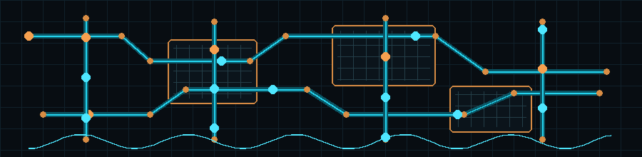

<h1 align="center">Hi, I'm Famous Ghanyo Tay</h1>

  

  

  

## About Me

I am an electrical/electronics engineer with a growing focus on digital IC design, RTL development, FPGA implementation, ASIC design flow, and VLSI systems. I enjoy taking hardware ideas from architecture and datapath thinking into Verilog modules, simulation, verification, and eventually synthesis-ready designs.

I currently work as a Product Safety Engineer in the medical devices industry, where I think deeply about risk, standards, reliability, and engineering decisions that affect real users. That safety-focused mindset also shapes how I approach hardware design: clear requirements, disciplined verification, and dependable systems.

- BSc Electrical/Electronics Engineering
- MSc Biomedical Engineering, University of Toronto
- Currently building projects in Verilog HDL, RTL design, and digital systems
- Interested in ASIC/FPGA design, computer architecture, verification, and hardware acceleration
- Reach me at **famoustay55@gmail.com**
- Personal website: [famoustay.com](https://famoustay.com)

## Current Hardware Focus

  

- **RTL Design:** modular Verilog, parameterized datapaths, finite-state machines, counters, registers, ALUs, and digital control logic
- **Verification:** directed testbenches, waveform analysis, simulation transcripts, assertions, and self-checking testbench practices
- **FPGA/ASIC Direction:** synthesis-aware coding style, timing concepts, clock/reset discipline, and scalable hardware architecture
- **Digital IC Foundations:** CMOS logic, combinational/sequential circuits, datapath/control partitioning, and VLSI design methodology

## VLSI Learning Roadmap

### ✅ Foundations — Complete
- **HDL Design:** Verilog RTL — combinational logic, sequential circuits, FSMs, parameterized modules
- **Scripting:** TCL — automation scripts for EDA tool flows
- **Verification:** Directed testbenches, simulation with ModelSim/GTKWave, waveform analysis
- **Projects built:** ALU, 8-bit CPU, 16-bit Register File, LFSR — all designed and verified in Verilog

### 🔧 Currently Working On — Synthesis & Physical Design
- **RTL-to-GDSII flow** using **OpenLane** with the **SkyWater 130nm PDK**
- Running synthesis, floorplanning, placement, routing, and DRC/LVS sign-off on custom Verilog designs
- Learning to interpret **timing reports** (setup/hold slack, critical path analysis)
- Understanding **area and power trade-offs** from synthesis reports

### 📚 Next Up — Timing Closure & Formal Methods
- **Static Timing Analysis (STA):** OpenSTA, understanding clock trees and timing constraints (SDC)
- **Formal Verification:** SymbiYosys / property checking, writing SVA assertions
- **Low-power design:** Clock gating, multi-Vt cell selection, power intent (UPF basics)

### 🎯 Long-Term Goals
- Tape-out experience via open-source shuttle programs (e.g., Efabless / Google MPW)
- Exposure to industry ASIC flows: Synopsys Design Compiler, Cadence Innovus
- FPGA prototyping of ASIC designs using Vivado targeting Xilinx devices

## Featured Projects

- [Parameterized Modular ALU in Verilog](https://github.com/Brafamous/ALU_DESIGN)  
  Designed and verified a scalable ALU architecture with arithmetic, logic, comparison, and shift units using a decoder-controlled RTL hierarchy.
- [8-Bit CPU Design in Verilog](https://github.com/Brafamous/8_bit-CPU_Design)
  Designed and implemented a complete 8-bit CPU with ALU, registers, control unit, and instruction set using Verilog HDL.
- [16-Bit Register Design](https://github.com/Brafamous/16-bit-Register-Design)
  Designed and verified a parameterized 16-bit register file in Verilog for use in digital datapaths.
- [Linear Feedback Shift Register (LFSR) Design](https://github.com/Brafamous/Linear-Feedback-Shift-Register-Design)
  Implemented a Verilog-based LFSR for pseudo-random sequence generation and digital testing applications.

## Tools and Technologies

  
  
  
  
  
  
  
  
  

## Connect With Me

  
  
  

 

<!---
Brafamous/Brafamous is a special repository because its README.md appears on your GitHub profile.
--->
